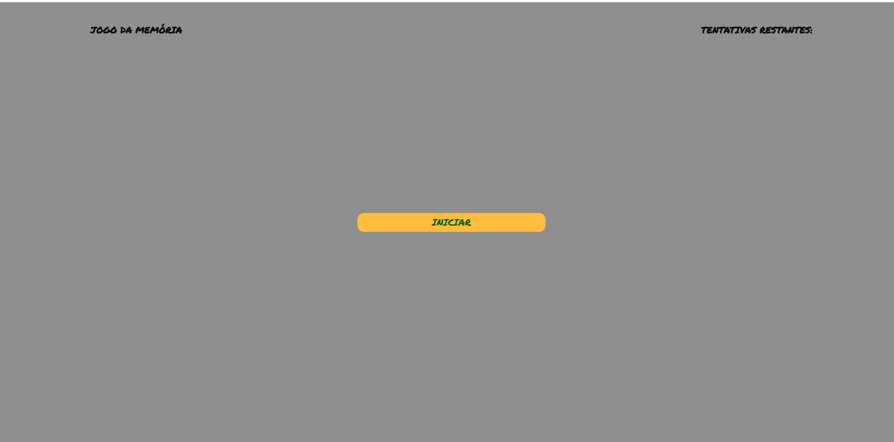
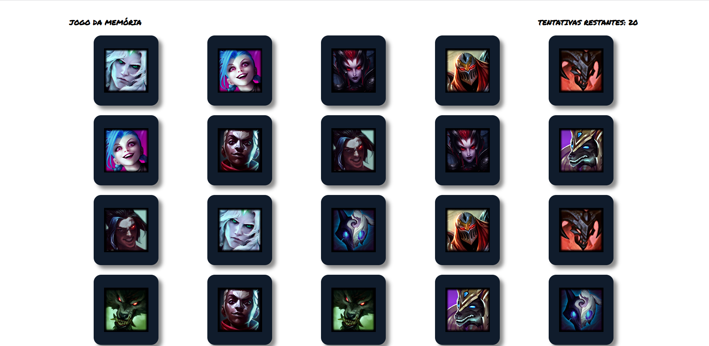
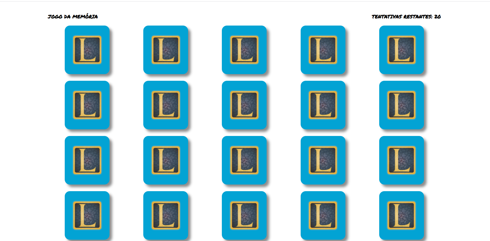

# Jogo da Memória
Jogo da Memória com personagens de League of Legends.
# Sobre o projeto
Projeto criado para colocar em prática alguns conhecimentos que adquiri em cursos pela web. É um projeto de visual simples apenas para estudo de JavaScript, lógica, orientação a objetos e ES6.
# Layout

# Tecnologias utilizadas
HTML  
CSS  
JavaScript  
# Autor
**Igor Mucharski**

[LinkedIn](www.linkedin.com/in/igormucharski)

# Executar projeto no navegador

[Ir!](https://mucharski.github.io/jogomemoria/src/index.html)
